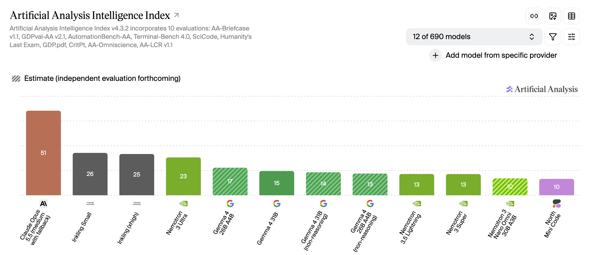

# Autoresearch Workshop

This workshop is to help you understand and use autoresearch at work and in your own projects.

## Autoresearch

Autoresearch is a technique created by Andrej Karpathy for training models. [link](https://github.com/karpathy/autoresearch)

However, the same approach can be used to optimize basically anything that has a measurable goal. Tobias Lutke, of Shopify fame, created a plugin for pi that uses this technique, but other autoresearch plugins exist for other harnesses as well:

- [davebcn87/pi-autoresearch](https://github.com/davebcn87/pi-autoresearch)
- [drivelineresearch/autoresearch-claude-code](https://github.com/drivelineresearch/autoresearch-claude-code)
- [moedesux/autoresearch-opencode](https://github.com/moedesux/autoresearch-opencode)
- [uditgoenka/autoresearch](https://github.com/uditgoenka/autoresearch)(Claude, OpenCode, Codex)

This workshop will focus on using [pi-autoresearch](https://github.com/davebcn87/pi-autoresearch). But you can use any one you want, I just won't be able to help as much with troubleshooting.

## Requirements

Before the workshop begins you may want to have a few things installed to save time and keep from overloading the Wi-fi network.

### NodeJS

This workshop will be focused on JS projects for the time being. You will need NodeJS installed.

See instructions for your platform at [https://nodejs.org/en/download/](https://nodejs.org/en/download/)

#### PNPM recommended

NodeJS ships with NPM by default, but this repo is set up to use PNPM. If you don't want to use PNPM, you can still use NPM, but you will need to handle installing dependencies for the demo-projects individually.

PNPM setup: [https://pnpm.io/installation](https://pnpm.io/installation)

> Note: You may want to perform an NPM/PNPM install of demo-project dependencies before the workshop.

### Pi Coding Agent

Pi is a minimal, extensible agent harness that you can make your own.

Make sure `pi` is installed and updated. If you don't have it installed you can run:

```bash
#curl
curl -fsSL https://pi.dev/install.sh | sh

# npm
npm install -g --ignore-scripts @earendil-works/pi-coding-agent

# pnpm
pnpm add -g --ignore-scripts @earendil-works/pi-coding-agent

# bun
bun add -g --ignore-scripts @earendil-works/pi-coding-agent

# powershell
powershell -c "irm https://pi.dev/install.ps1 | iex"
```

### pi-autoresearch

This workshop focuses on using `pi-autoresearch`.

To install the pi-plugin, you can run:

```bash
pi install npm:pi-autoresearch
```

### OpenRouter

An OpenRouter account is recommended for this workshop. You can sign up for a free account at [https://openrouter.ai](https://openrouter.ai) and use their [free models](https://openrouter.ai/models?variant=free&output_modalities=text).

You will need to create an API key and save it in your environment variables before running pi.

You can also save the API key in `~/.pi/agent/auth.json`.

```json
{
  "openrouter": {
    "type": "api_key",
    "key": "sk-or-your-key-here"
  }
}
```

#### Recommended Models

OpenRouter, at the time of this writing, has around 16 free models to choose from. However, some are not suited well to coding tasks. It is not recommended to use paid API-token-priced models from OpenRouter for this workshop.

For the sake of this workshop, I recommend looking at the following models:

- apodex/apodex-1.1-mini:free
- dots-studio/dots-3-note-preview:free
- nvidia/nemotron-3.5-lightning:free
- thinkingmachines/inkling-small:free
- poolside/laguna-xs-2.1:free
- cohere/north-mini-code:free
- google/gemma-4-26b-a4b-it:free



These models are not the most intelligent models. But, the case to be made in this workshop is that absolute intelligence is not as important when you can just loop a model on optimizing a score.

#### Other Providers

There are other providers of open models that you can use. They will give you more access to more intelligent open weight models.

- [OpenCode Go](https://opencode.ai/go) ($10/mo)
- [Ollama Cloud](https://ollama.com/pricing) ($20/mo)
- Local hosting (not recommended for this workshop due to speed)

## Fork This Tepo

You will likely want to push your work to branches and PRs so you can evaluate the results of your autoresearch sessions.

## Issues/Suggestions

If you run into problems setting up this repo outside of the workshop, please submit issues and/or PRs to this repo directly.

## License

This repo is licensed under the [MIT License](./LICENSE).
